<div align="center">

# ⚽ GoalBet

**The football prediction game for you and your friends.**
Predict match outcomes across 5 tiers, stake coins, and compete on a live leaderboard — free, no real money.

[](https://github.com/Roychen651/goalbet/actions/workflows/ci.yml)
</div>

---

## The Idea

GoalBet started as a simple question: *what if you could predict every detail of a football match — not just the winner — and compete with your mates in a private group?*

No bookmakers. No real money. Just a points game where being specific pays off more. Predict the exact score, call the corner count, guess BTTS — every tier you nail adds to your tally. A wrong result can still score you points on goals and corners. The leaderboard is live. The rivalry is real.

<p align="center">
  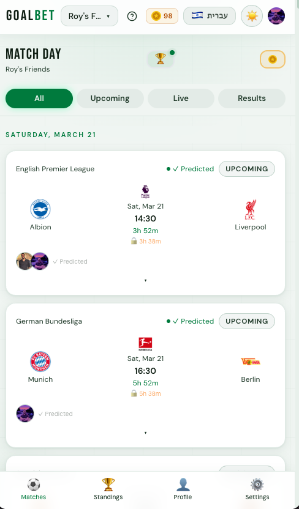
  &nbsp;&nbsp;
  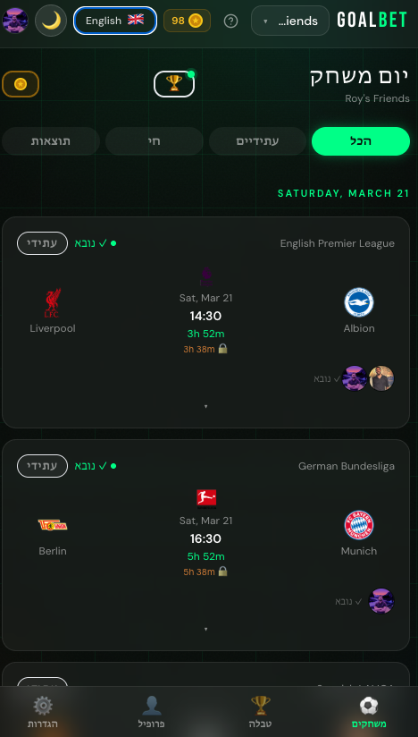
</p>

<p align="center">
  <sub>Upcoming matches from your active leagues — dark & light mode, English & Hebrew</sub>
</p>

---

## Pick Your Tiers

Each match has up to 5 prediction tiers. You choose which ones to play — stake coins on each, earn back double per point scored.

<p align="center">
  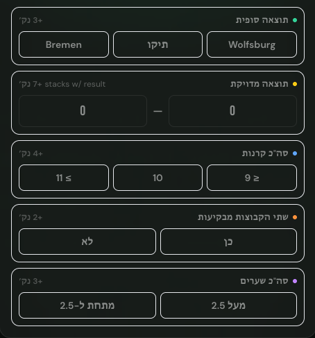
</p>

| Tier | Category | Points |
|------|----------|--------|
| **1** | Full Time Result — Home / Draw / Away | **+3** |
| **2** | Exact Score — stacks on top of Tier 1 | **+7** (= **10** total) |
| **3** | Total Corners — ≤9 / exactly 10 / ≥11 | **+4** |
| **4** | Both Teams to Score — Yes / No | **+2** |
| **5** | Over / Under 2.5 Goals | **+3** |

**Maximum: 19 pts per match.** Getting the exact score right automatically gives you Tier 1 — because the result is implied.

<p align="center">
  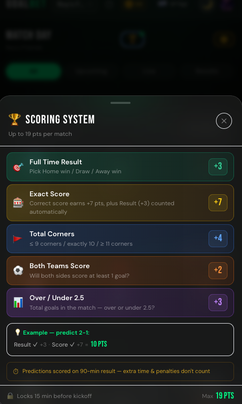
</p>

---

## After the Whistle

Once a match ends, predictions resolve automatically. Every card in your history shows you exactly which tiers hit — green ticks for points, times for misses. No ambiguity.

<p align="center">
  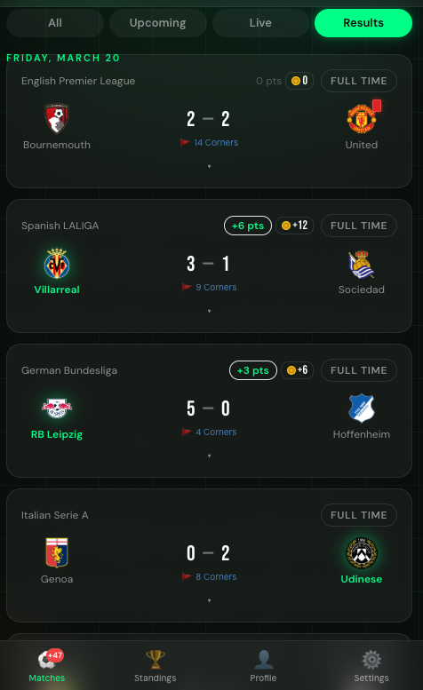
  &nbsp;&nbsp;
  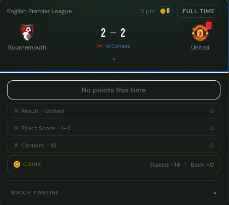
</p>

<p align="center">
  <sub>Left: results feed with corners data and point badges · Right: per-tier breakdown after full time</sub>
</p>

Corners are entered manually after each match (corner data isn't in any free live API). Once the number is set, corners predictions resolve on the next sync — usually within minutes.

Match timelines show goals, yellow/red cards, and substitutions — so you can see exactly why your exact score missed by one.

<p align="center">
  
</p>

---

## The Leaderboard

Standings update in real-time via Supabase Realtime. Three views: **All Time**, **This Week**, **Last Week**. Your rank card shows points and result-pick hit rate for the current period.

<p align="center">
  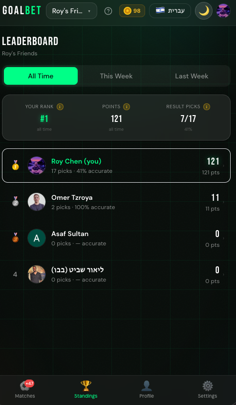
  &nbsp;&nbsp;
  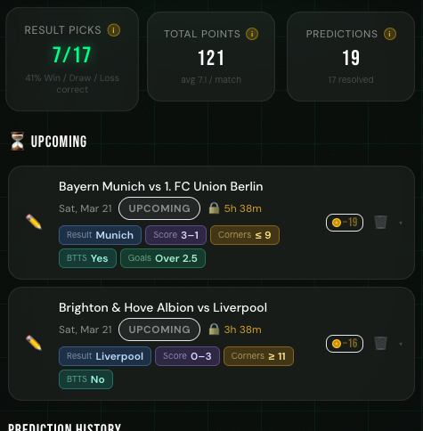
</p>

<p align="center">
  <sub>Left: group standings with accuracy % · Right: personal prediction history</sub>
</p>

---

## Head to Head

Tap any player's leaderboard row to open a side-by-side comparison — who called what, who won each match, and the overall H2H tally for the week.

<p align="center">
  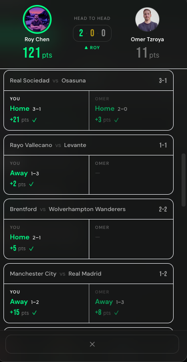
</p>

Predictions are hidden (🔒) for matches that haven't kicked off yet — no tactical copying. Once a match starts, both picks are revealed. The rivalry is visible only after it can't be gamed.

---

## The Coin Economy

Coins keep the game interesting without any real money involved. You stake them when you predict and earn back double per point scored.

<p align="center">
  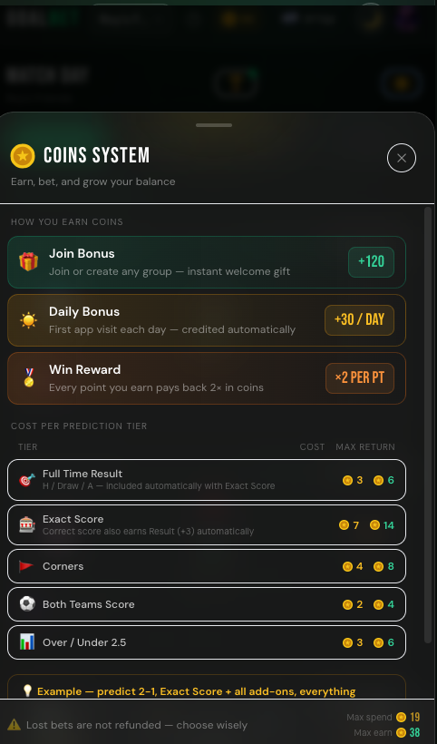
</p>

| Event | Coins |
|-------|-------|
| Join bonus (one-time) | **+120** 🪙 |
| Daily login bonus | **+30** 🪙 |
| Stake on a prediction | −(cost of tiers) |
| Earn back per correct tier | **points × 2** |

Stake all 5 tiers → 19 coins out. Hit them all → 38 coins back. Your balance is always shown as ≥ 0. No negative numbers, no punishment messaging — just earnings.

---

## Built for Everyone

Full Hebrew support with automatic RTL layout. Language toggle in Settings. Dark and light mode — toggle from the top bar.

<p align="center">
  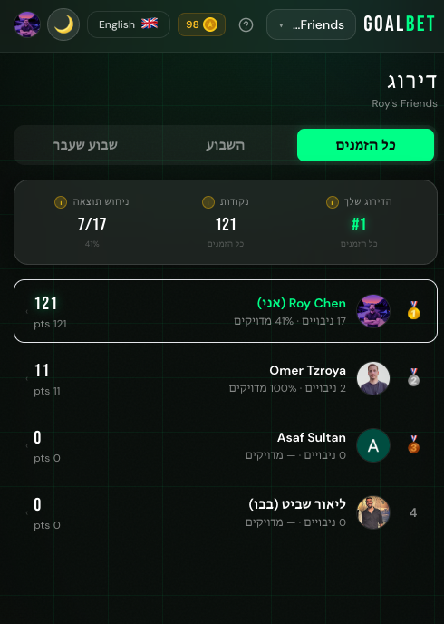
  &nbsp;&nbsp;
  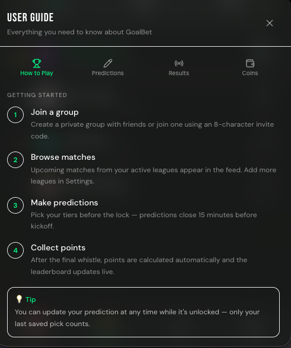
</p>

<p align="center">
  <sub>Left: Hebrew leaderboard (full RTL) · Right: built-in User Guide — tap the ? icon anywhere in the app</sub>
</p>

---

## Tech Stack

| Layer | Technology |
|-------|------------|
| **Frontend** | React 18, Vite 5, TypeScript, TailwindCSS 3, Framer Motion |
| **Backend** | Node.js 18, Express, TypeScript, node-cron |
| **Database** | Supabase — PostgreSQL, Row-Level Security, Realtime, Auth |
| **Football data** | ESPN public scoreboard API — free, no key required |
| **State** | Zustand with localStorage persistence |
| **CI/CD** | GitHub Actions — type-check + build on push, sync cron every 30 min |
| **Deployment** | Vercel (frontend) · Render (backend) |

### Why ESPN over TheSportsDB

TheSportsDB's free key (`"3"`) ignores the `?id=` parameter and returns wrong league data. ESPN's public scoreboard endpoint requires no auth, returns reliable real-time data, and covers all major leagues. No API key to manage.

### Why GitHub Actions as a heartbeat

The backend runs on Render's free tier — it sleeps after ~15 min of inactivity. Rather than pay for an always-on dyno, a GitHub Actions cron pings the backend every 30 minutes. This wakes it *and* triggers the sync. Scores and fixtures stay current 24/7 at zero cost.

---

## Project Structure

```
goalbet/
├── frontend/                  # React + Vite SPA
│   └── src/
│       ├── components/
│       │   ├── layout/        # AppShell, TopBar, BottomNav, Sidebar
│       │   ├── matches/       # MatchCard, MatchFeed, PredictionForm
│       │   ├── leaderboard/   # LeaderboardTable, H2HModal, UserMatchHistoryModal
│       │   ├── groups/        # CreateGroupModal, JoinGroupModal
│       │   └── ui/            # GlassCard, NeonButton, ScoringGuide, CoinGuide,
│       │                      # HelpGuideModal, InfoTip, ThemeToggle, Avatar…
│       ├── hooks/             # useMatches, usePredictions, useLeaderboard,
│       │                      # useGroupMatchPredictions, useNewPointsAlert…
│       ├── lib/               # supabase.ts, utils.ts, i18n.ts, constants.ts
│       ├── pages/             # HomePage, LeaderboardPage, ProfilePage, SettingsPage
│       └── stores/            # authStore, groupStore, coinsStore, langStore,
│                              # themeStore, uiStore (Zustand)
│
├── backend/                   # Express API + cron scheduler
│   └── src/
│       ├── routes/            # GET /health · POST /api/sync/matches · POST /api/sync/scores
│       ├── services/
│       │   ├── espn.ts        # ESPN API client
│       │   ├── matchSync.ts   # Syncs ESPN data into Supabase (7 days back, 21 ahead)
│       │   ├── scoreUpdater.ts# Resolves predictions after FT, updates leaderboard + coins
│       │   └── pointsEngine.ts# Pure scoring function — zero side effects, unit-testable
│       └── cron/              # Startup sync, 30s score poller, daily sync, weekly reset
│
└── supabase/
    └── migrations/            # SQL migrations 001 → 021 (run in order)
```

---

## Quick Start

### Prerequisites

- Node.js 18+
- A [Supabase](https://supabase.com) project (free tier works)
- Google OAuth credentials (Client ID + Secret from Google Cloud Console)

### 1. Clone & install

```bash
git clone https://github.com/Roychen651/goalbet.git
cd goalbet
cd frontend && npm install
cd ../backend && npm install
```

### 2. Supabase setup

1. Create a new project at [supabase.com](https://supabase.com)
2. Open the **SQL Editor** and run migrations in order:
   `supabase/migrations/001_initial_schema.sql` → `021_fix_coins.sql`
3. In **Authentication → Providers**, enable Google OAuth
4. In **Authentication → URL Configuration**, add:
   - Site URL: `http://localhost:5173`
   - Redirect URL: `http://localhost:5173/auth/callback`

### 3. Environment variables

`frontend/.env.local`:
```env
VITE_SUPABASE_URL=https://your-project-ref.supabase.co
VITE_SUPABASE_ANON_KEY=your-anon-key
VITE_BACKEND_URL=http://localhost:3001
```

`backend/.env`:
```env
PORT=3001
SUPABASE_URL=https://your-project-ref.supabase.co
SUPABASE_SERVICE_KEY=your-service-role-key
NODE_ENV=development
```

### 4. Run locally

```bash
# Terminal 1 — Frontend at http://localhost:5173
cd frontend && npm run dev

# Terminal 2 — Backend at http://localhost:3001
cd backend && npm run dev
```

---

## Deployment

### Frontend → Vercel

1. Connect your GitHub repo to [Vercel](https://vercel.com), root dir = `frontend`
2. Add env vars: `VITE_SUPABASE_URL`, `VITE_SUPABASE_ANON_KEY`, `VITE_BACKEND_URL`
3. Auto-deploys on every push to `main`

### Backend → Render

1. Create a **Web Service**, root dir = `backend`
2. Build: `npm run build` · Start: `npm start`
3. Add env vars: `SUPABASE_URL`, `SUPABASE_SERVICE_KEY`, `NODE_ENV=production`

On startup the backend runs a catch-up sync (resolves any matches missed while sleeping), then polls for live scores every 30 seconds.

### GitHub Actions — Required Secret

Add one secret in your repo settings:
- `BACKEND_URL` — e.g. `https://goalbet-api.onrender.com`

No other secrets needed. Sync endpoints are intentionally public.

---

## Scoring Reference

| File | Purpose |
|------|---------|
| `backend/src/services/pointsEngine.ts` | Source of truth — pure scoring function |
| `frontend/src/lib/utils.ts → calcBreakdown()` | Client-side mirror of pointsEngine |
| `frontend/src/lib/constants.ts` | Points values, coin costs, league list |
| `frontend/src/lib/i18n.ts` | All UI strings — EN + HE |

---

## License

MIT — free to use, fork, and adapt. No gambling. No real money.
