<div align="center">

# GoalBet

**The football prediction game for you and your friends.**

Predict match outcomes across 5 tiers, stake virtual coins, and climb a real-time leaderboard — all free, no real money involved.

[](https://github.com/Roychen651/goalbet/actions/workflows/ci.yml)

</div>

---

<p align="center">
  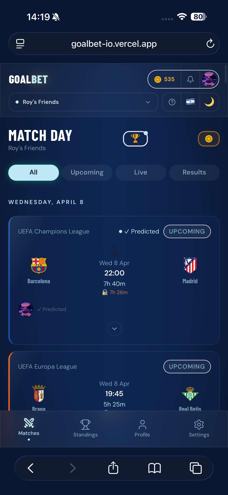
  &nbsp;&nbsp;&nbsp;
  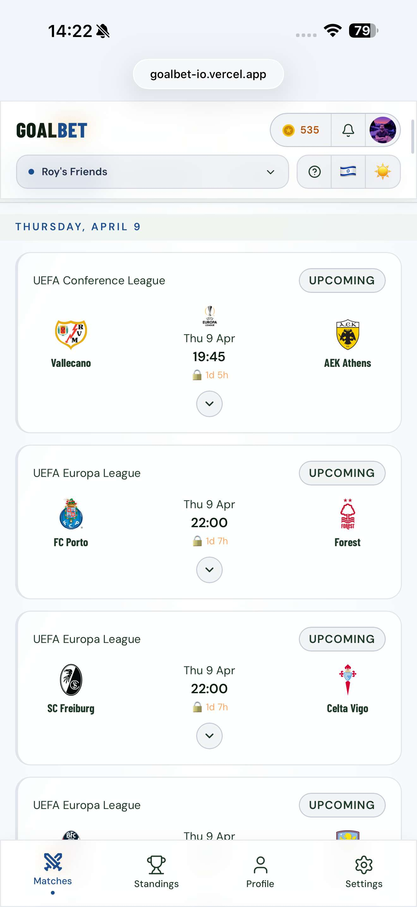
</p>

<p align="center">
  <sub>The match feed — Champions League, Europa League, Conference League and more. Dark & light themes.</sub>
</p>

---

## How It Works

GoalBet is a private prediction game for friend groups. You create or join a group with an invite code, browse upcoming matches from 14 leagues, and lock in your predictions before kickoff. After the final whistle, points are calculated automatically and your group's leaderboard updates in real-time.

No bookmakers. No real money. Just bragging rights — and a coin economy that makes every pick feel meaningful.

---

## Making Predictions

Expand any upcoming match to see **team form** (last 5 results with W/D/L dots), the **venue**, and all **5 prediction tiers**. Each tier has a point value — you choose which ones to play and stake coins on each.

<p align="center">
  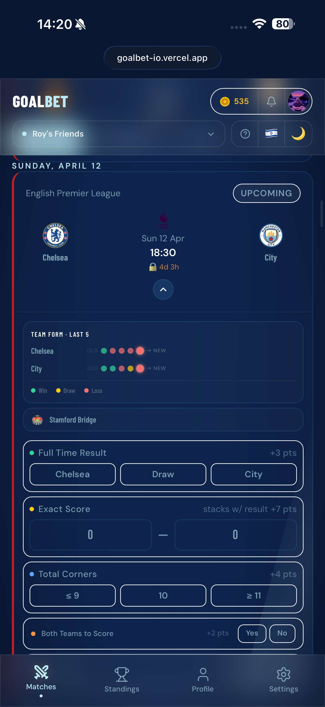
</p>

<p align="center">
  <sub>Chelsea vs Man City — team form, Stamford Bridge, and the full 5-tier prediction form</sub>
</p>

| Tier | What You Predict | Points |
|------|------------------|--------|
| **1** | Full Time Result — Home / Draw / Away | **+3** |
| **2** | Exact Score — stacks with Tier 1 | **+7** (= **10** total) |
| **3** | Total Corners — ≤9 / exactly 10 / ≥11 | **+4** |
| **4** | Both Teams to Score — Yes / No | **+2** |
| **5** | Over / Under 2.5 Goals | **+3** |

**Maximum per match: 19 points.** Nailing the exact score automatically awards Tier 1 — the result is implied.

Predictions lock **15 minutes** before kickoff. You can update your pick as many times as you want until then.

<p align="center">
  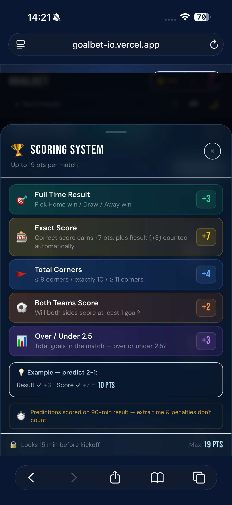
</p>

<p align="center">
  <sub>The in-app Scoring Guide — example: predict 2-1, get both Result (+3) and Score (+7) = 10 PTS</sub>
</p>

---

## After the Whistle

Once a match ends, your prediction resolves automatically. The results tab shows the final score, BTTS, total goals, and corner count — plus expandable sections for detailed match stats, a minute-by-minute timeline, and full lineups.

<p align="center">
  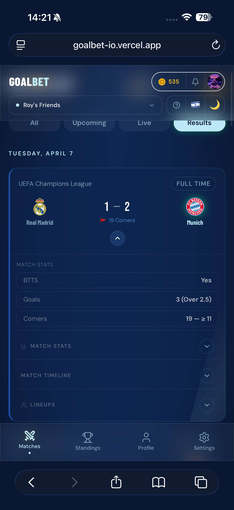
  &nbsp;&nbsp;&nbsp;
  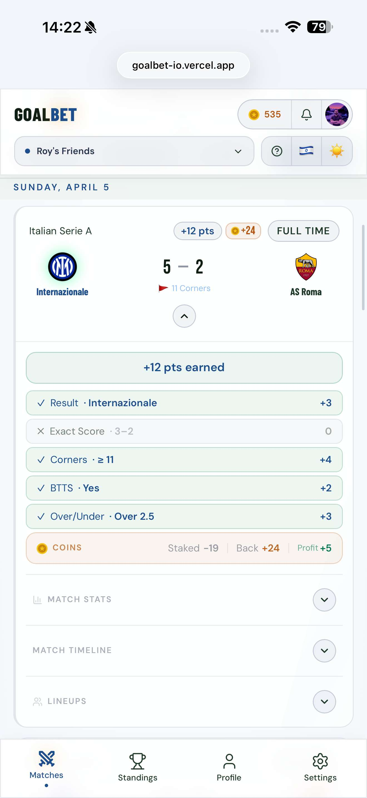
</p>

<p align="center">
  <sub>Left: Real Madrid 1-2 Bayern Munich — BTTS, goals, corners at a glance · Right: Inter 5-2 Roma — tier-by-tier breakdown with +12 pts and coin profit (light mode)</sub>
</p>

### Match Deep Dive

Every completed match has three expandable sections — full stats, a chronological timeline with goal commentary, and both teams' starting lineups with formations.

<p align="center">
  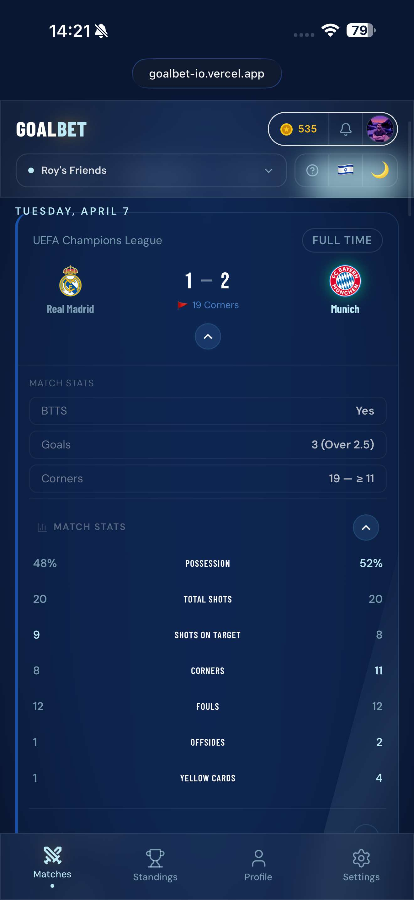
  &nbsp;&nbsp;
  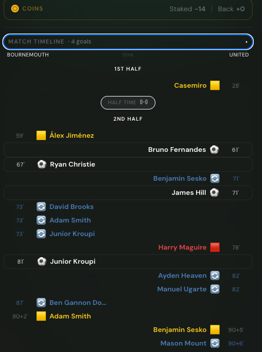
  &nbsp;&nbsp;
  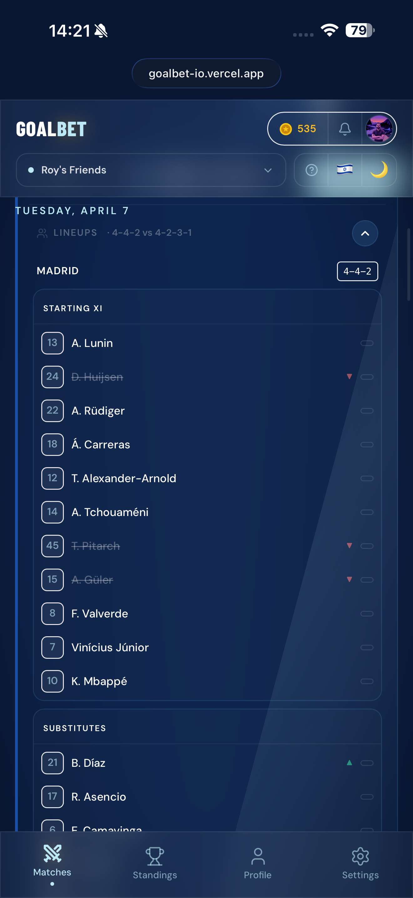
</p>

<p align="center">
  <sub>Real Madrid vs Bayern Munich — Stats (possession, shots on target, corners) · Timeline (goals with ESPN commentary, half-time score, red cards) · Lineups (4-4-2 vs 4-2-3-1 with jersey numbers)</sub>
</p>

---

## The Leaderboard

Group standings update in real-time via Supabase Realtime. Three time periods: **All Time**, **This Week**, **Last Week**.

At the top, three insight badges highlight the group leaders:
- **On Fire** — highest total points
- **The Sniper** — best accuracy percentage
- **The Grinder** — most predictions made

Your personal rank card shows your position, total points, and result-pick accuracy.

<p align="center">
  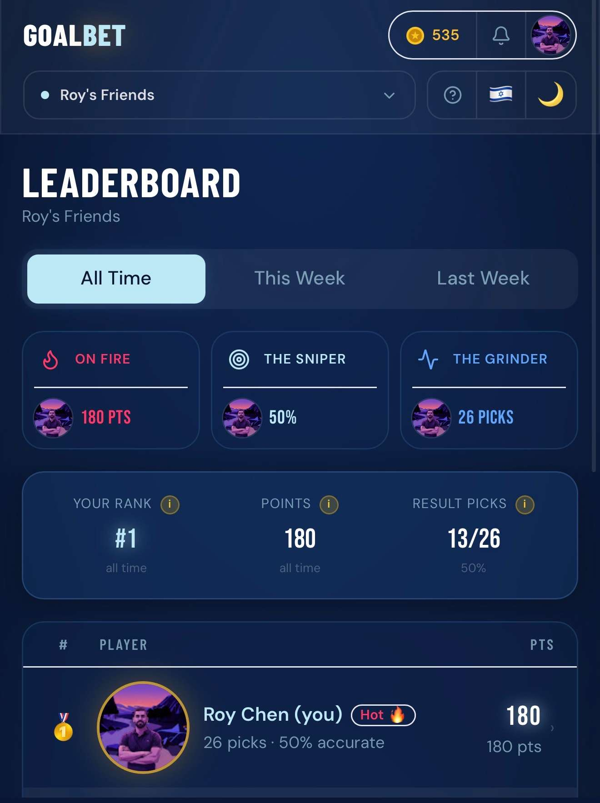
</p>

<p align="center">
  <sub>Rank #1 — 180 pts, 13/26 result picks correct (50% accuracy), 26 predictions made</sub>
</p>

---

## Head to Head

Tap another player's row on the leaderboard to open the **H2H modal** — a side-by-side comparison of every match you both predicted.

Pre-kickoff predictions are **locked** (padlock icon) so nobody can copy. Once a match starts, both picks are revealed alongside the actual result and points earned.

<p align="center">
  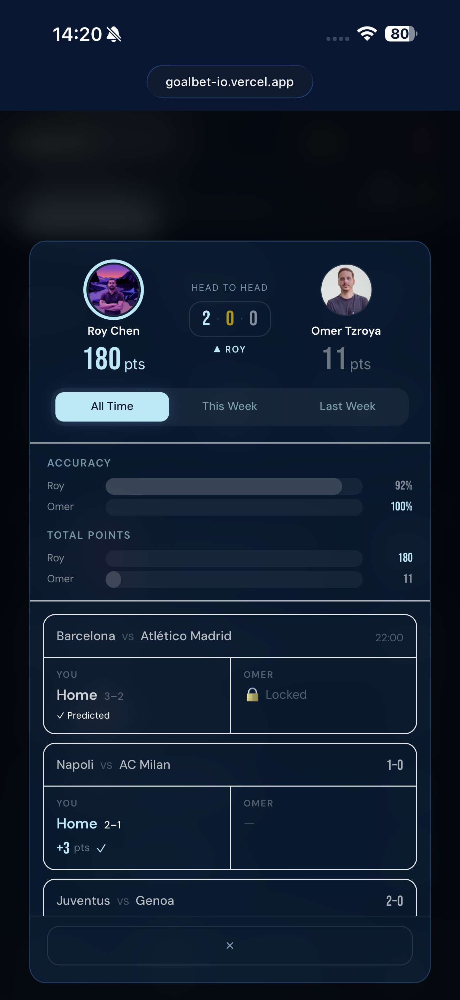
  &nbsp;&nbsp;&nbsp;
  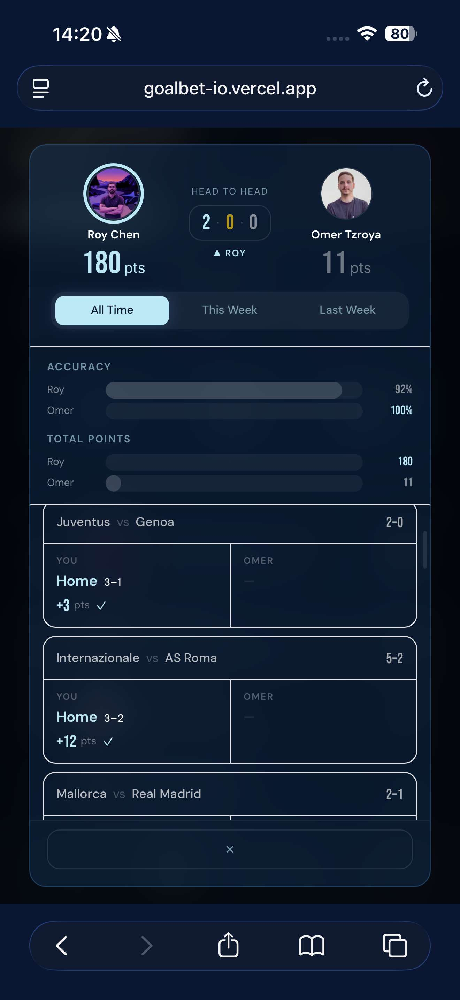
</p>

<p align="center">
  <sub>Left: Roy vs Omer — Barcelona vs Atletico locked (pre-kickoff), Napoli vs Milan revealed · Right: scrolled down — Juve (+3 pts), Inter vs Roma (+12 pts), Mallorca vs Real Madrid</sub>
</p>

---

## Profile & Analytics

Your profile is a personal analytics dashboard built as a **bento grid**. At a glance: total points, FT win rate, prediction count, current streak, and score precision.

Below the stats grid: **Personal Analytics** cards (best performing tier, average goals off), **Recent Form** as colored dots, your **upcoming prediction** with all tier badges, and a scrollable **Prediction History** with per-match results.

<p align="center">
  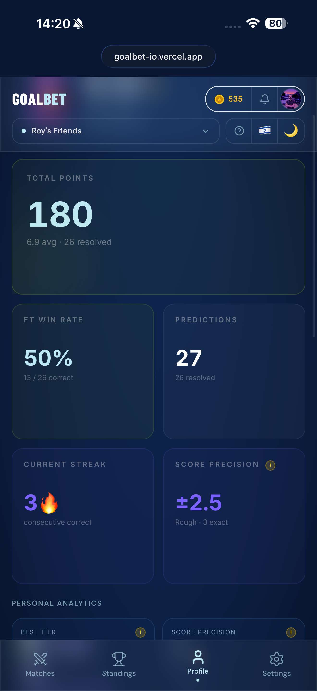
  &nbsp;&nbsp;&nbsp;
  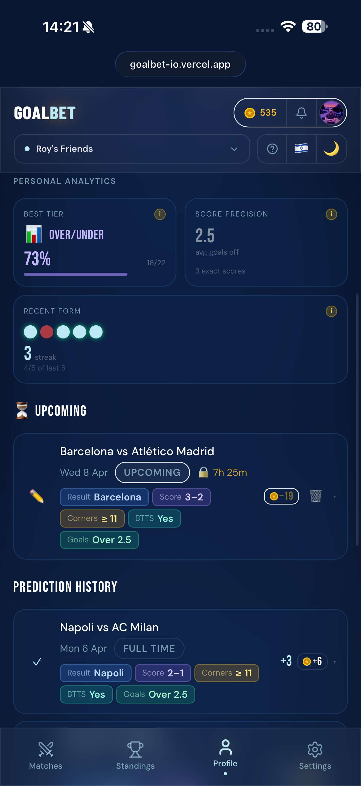
</p>

<p align="center">
  <sub>Left: stats overview — 180 pts (6.9 avg), 50% win rate, 3-match streak, ±2.5 score precision · Right: best tier is Over/Under at 73%, upcoming Barcelona vs Atletico pick, Napoli +3 pts history</sub>
</p>

---

## The Coin Economy

Coins make every prediction feel like it matters. You stake coins when you predict, and earn back **double per point scored**.

<p align="center">
  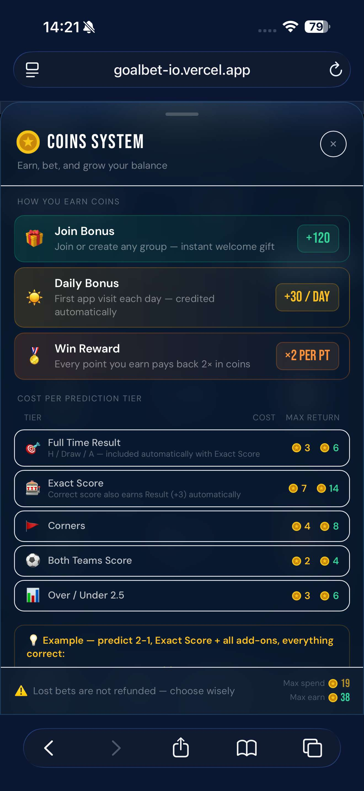
</p>

<p align="center">
  <sub>Join Bonus (+120), Daily Bonus (+30/day), Win Reward (+2 per point) — plus cost and max return per tier</sub>
</p>

| Event | Coins |
|-------|-------|
| Join a group (one-time) | **+120** |
| Daily login bonus | **+30 / day** |
| Stake a prediction | -(sum of tiers played) |
| Correct tier reward | **points x 2** |

Max spend per match: **19 coins**. Max return: **38 coins**. Lost bets are not refunded — choose wisely.

---

## AI-Powered Insights

Every match picks up a layer of generative commentary — no extra taps, no loading spinners. All text is produced **once** on the backend by Groq (Llama 3.1 8B Instant) in both English and Hebrew, cached in Supabase, and served as plain text. If the model ever fails or rate-limits, the feature silently hides itself. Zero paid APIs.

- **Scout Insight** — a one-sentence tactical angle on every upcoming match, surfaced inside the expanded card and at the top of the prediction modal
- **Half-Time Read** — a live broadcast-style lower-third that appears on the match card during the HT break, predicting the second half based on what actually happened in the first. Typewriter reveal, pulsing red `LIVE AI READ` badge, animated neon border
- **Match Recap** — a witty two-sentence post-match summary that slots in above the full stats once the final whistle blows
- **Hall of Fame Chronicles** — nail a perfect score (+10 pts) on a top-tier European match and you earn a 3D gold-and-crimson card on your profile with a mythical Groq-generated saga about your pick. Cards tilt with your cursor / touch

---

## Notifications

The bell icon opens a glassmorphism dropdown with real-time notifications. When a prediction resolves, you see the match result, points earned, and coins gained — all at a glance.

<p align="center">
  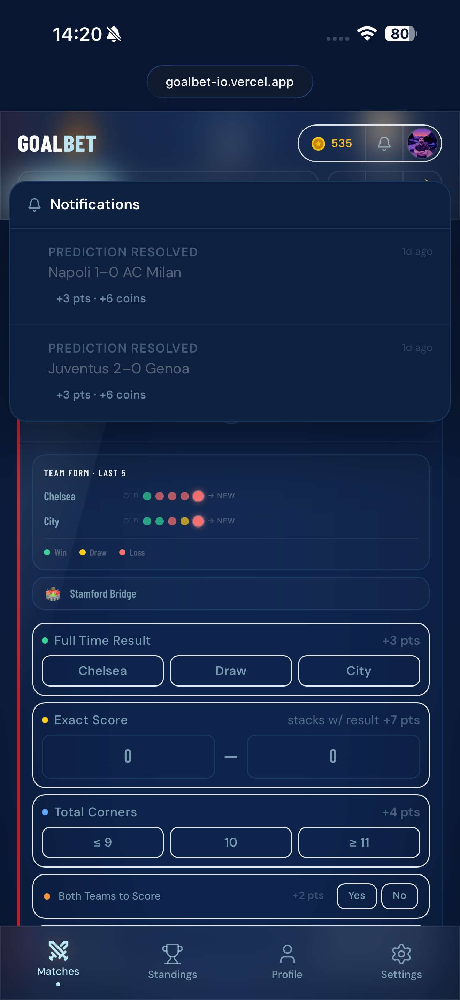
</p>

<p align="center">
  <sub>Napoli 1-0 AC Milan → +3 pts, +6 coins · Juventus 2-0 Genoa → +3 pts, +6 coins</sub>
</p>

---

## Settings

Language, theme, animations, and account management — all on one clean page.

- **Language:** English / Hebrew — instant switch with full RTL layout flip
- **Theme:** Dark (Cold Sea Navy) / Light (Frost) — one tap
- **Live Match Animations:** Toggle score flips and live breathing effects
- **Account:** View email, change password, sign out

<p align="center">
  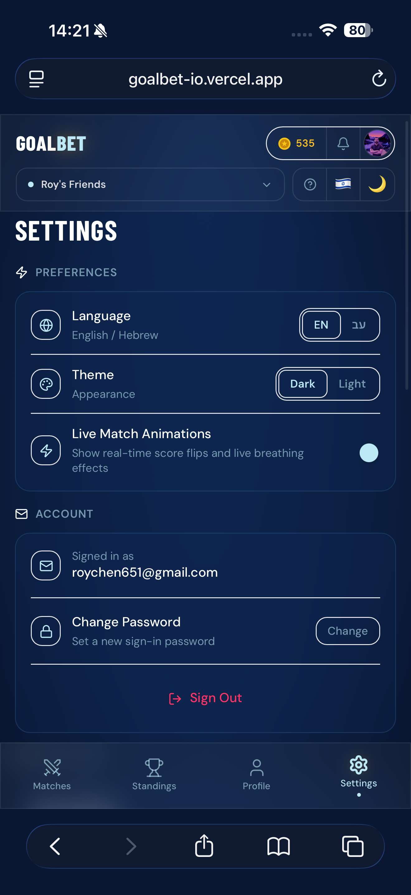
</p>

---

## Built for Everyone — Hebrew & RTL

Full Hebrew localization with **automatic RTL layout**. Every element — match stats tables, leaderboard badges, navigation — flips correctly. The Hebrew copy uses natural sports-broadcaster tone, not machine translation.

<p align="center">
  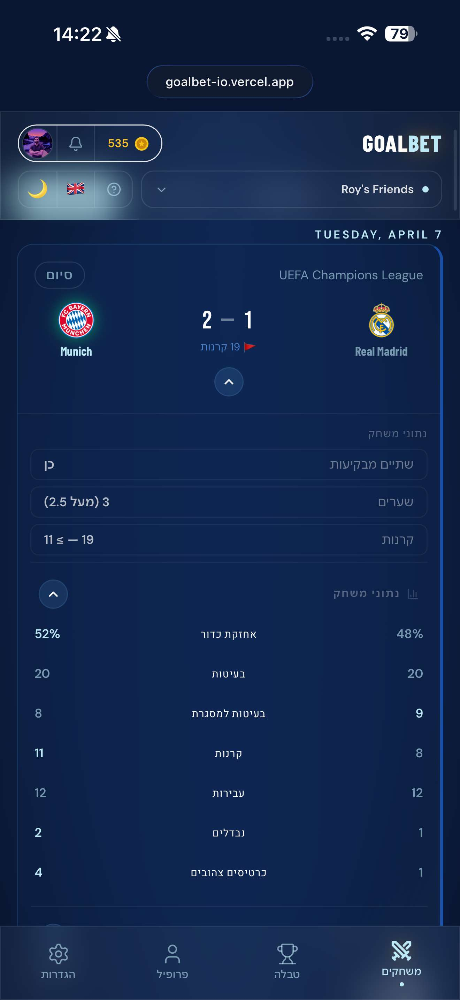
  &nbsp;&nbsp;&nbsp;
  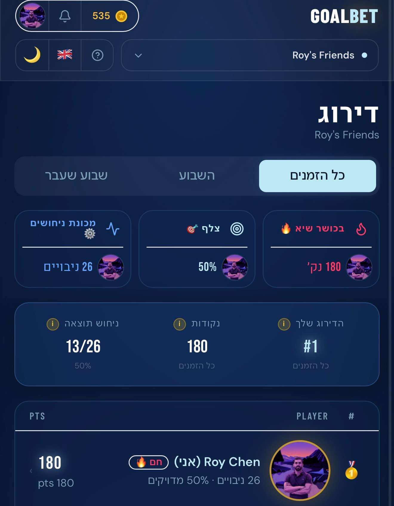
</p>

<p align="center">
  <sub>Left: Bayern 2-1 Real Madrid — match stats in Hebrew (אחזקת כדור, בעיטות, קרנות) · Right: leaderboard with Hebrew insight badges (בכושר טיא, צלף, מכונת ניחושים)</sub>
</p>

---

## Built-in User Guide

Tap the help icon anywhere in the app. A tabbed modal walks new users through everything — **How to Play**, **Predictions**, **Results**, and **Coins** — in four clear steps.

<p align="center">
  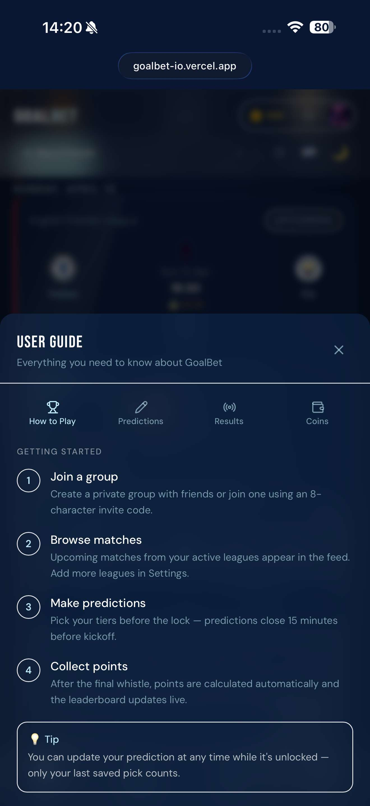
</p>

<p align="center">
  <sub>Step 1: Join a group · Step 2: Browse matches · Step 3: Make predictions · Step 4: Collect points</sub>
</p>

---

## Supported Leagues

GoalBet covers **14 leagues** via ESPN's public API — no key required.

| League | Type |
|--------|------|
| Premier League | Domestic |
| La Liga | Domestic |
| Bundesliga | Domestic |
| Serie A | Domestic |
| Ligue 1 | Domestic |
| Champions League | European |
| Europa League | European |
| Conference League | European |
| FA Cup | Cup |
| League Cup (Carabao) | Cup |
| Copa del Rey | Cup |
| UEFA Nations League | International |
| World Cup Qualifiers 2026 | International |
| International Friendlies | International |

Each group can enable/disable leagues from Settings. Fixtures sync **42 days ahead**, results sync within minutes of full time.

---

## Tech Stack

| Layer | Technology |
|-------|------------|
| **Frontend** | React 18, Vite 5, TypeScript, TailwindCSS 3, Framer Motion |
| **Backend** | Node.js 18, Express, TypeScript, node-cron |
| **Database** | Supabase — PostgreSQL, Row-Level Security, Realtime subscriptions, Auth |
| **Football data** | ESPN public scoreboard API — free, no API key |
| **State management** | Zustand with localStorage persistence |
| **CI/CD** | GitHub Actions — type-check + build on push, live score sync every 5 min |
| **Hosting** | Vercel (frontend) · Render (backend) |

### Design decisions

**Why ESPN over TheSportsDB?**
TheSportsDB's free tier returns incorrect data for league-specific queries. ESPN's public scoreboard endpoint is reliable, real-time, and covers all major leagues — no key management needed.

**Why GitHub Actions as a heartbeat?**
Render's free tier sleeps after ~15 minutes of inactivity. A GitHub Actions cron job pings the backend every 5 minutes — waking it up *and* triggering the score sync. Fixtures and scores stay current 24/7 at zero cost.

**Why Supabase Realtime?**
Leaderboard rankings and match scores push to all connected clients instantly. No polling, no stale data — when a match finishes and predictions resolve, everyone's leaderboard updates simultaneously.

---

## Project Structure

```
goalbet/
├── frontend/                  # React + Vite SPA
│   └── src/
│       ├── components/
│       │   ├── admin/         # Admin console (super-admin only)
│       │   ├── auth-v2/       # AuthContainer (8-view auth flow), PasswordStrength, ReAuthModal
│       │   ├── groups/        # Create / Join group modals
│       │   ├── layout/        # AppShell, TopBar, BottomNav, Sidebar, NotificationCenter
│       │   ├── leaderboard/   # LeaderboardTable, H2HModal, UserMatchHistoryModal
│       │   ├── matches/       # MatchCard, MatchFeed, PredictionForm, MatchTimeline
│       │   ├── profile/       # ProfileBentoV2, AvatarPicker, HallOfFameChronicles
│       │   └── ui/            # GlassCard, NeonButton, ScoringGuide, CoinGuide,
│       │                      # HelpGuideModal, HTAnalystCard, AIScoutCard,
│       │                      # Avatar, ThemeToggle, Toast...
│       ├── hooks/             # useMatches, usePredictions, useLeaderboard,
│       │                      # useAuthV2, useLiveClock, useNewPointsAlert...
│       ├── lib/               # supabase.ts, i18n.ts (EN + HE), constants.ts, utils.ts
│       ├── pages/             # Home, Leaderboard, Profile, Settings, Login, Admin
│       └── stores/            # authStore, groupStore, coinsStore, langStore,
│                              # themeStore, uiStore (Zustand)
│
├── backend/                   # Express API + cron scheduler
│   └── src/
│       ├── routes/            # health, sync, admin
│       ├── services/          # espn.ts, matchSync.ts, scoreUpdater.ts, pointsEngine.ts
│       └── cron/              # 30s live score poller, daily sync, weekly reset
│
├── supabase/
│   ├── migrations/            # SQL migrations 001 → 035
│   └── email-templates/       # Themed signup confirmation + password reset emails
│
└── .github/workflows/
    ├── ci.yml                 # Type-check + build on every push
    └── sync-cron.yml          # 5-min heartbeat: wake backend → resolve scores → sync fixtures
```

---

## Quick Start

### Prerequisites

- Node.js 18+
- A [Supabase](https://supabase.com) project (free tier works)
- Google OAuth credentials (Client ID + Secret from Google Cloud Console)

### 1. Clone & install

```bash
git clone https://github.com/Roychen651/goalbet.git
cd goalbet
cd frontend && npm install
cd ../backend && npm install
```

### 2. Supabase setup

1. Create a new project at [supabase.com](https://supabase.com)
2. Run migrations in order via the SQL Editor:
   `supabase/migrations/001_initial_schema.sql` → `035_ht_insight_and_chronicles.sql`
   (Or use the Supabase CLI: `supabase db push --linked`)
3. **Authentication → Providers:** enable **Email** + **Google OAuth**
4. **Authentication → URL Configuration:**
   - Site URL: `http://localhost:5173`
   - Redirect URL: `http://localhost:5173/auth/callback`
5. *(Recommended)* **Authentication → Email Templates:** paste the HTML from `supabase/email-templates/`

### 3. Environment variables

**`frontend/.env.local`**
```env
VITE_SUPABASE_URL=https://your-project-ref.supabase.co
VITE_SUPABASE_ANON_KEY=your-anon-key
VITE_BACKEND_URL=http://localhost:3001
```

**`backend/.env`**
```env
PORT=3001
SUPABASE_URL=https://your-project-ref.supabase.co
SUPABASE_SERVICE_KEY=your-service-role-key
NODE_ENV=development
GROQ_API_KEY=your-groq-key   # optional — if omitted, all AI text silently hides
```

### 4. Run locally

```bash
# Terminal 1 — Frontend
cd frontend && npm run dev    # → http://localhost:5173

# Terminal 2 — Backend
cd backend && npm run dev     # → http://localhost:3001
```

---

## Deployment

### Frontend → Vercel

1. Connect your GitHub repo, root dir = `frontend`
2. Set env vars: `VITE_SUPABASE_URL`, `VITE_SUPABASE_ANON_KEY`, `VITE_BACKEND_URL`
3. Add your production domain to Supabase **Redirect URLs**
4. Auto-deploys on push to `main`

### Backend → Render

1. Create a Web Service, root dir = `backend`
2. Build: `npm run build` · Start: `npm start`
3. Set env vars: `SUPABASE_URL`, `SUPABASE_SERVICE_KEY`, `NODE_ENV=production`

On startup the backend runs a catch-up sync — resolves any matches missed while sleeping, then polls for live scores every 30 seconds.

### GitHub Actions secret

Add `BACKEND_URL` (e.g. `https://goalbet-api.onrender.com`) to your repo secrets. No other secrets needed — sync endpoints are intentionally public.

---

## Key Files

| File | What it does |
|------|-------------|
| `backend/src/services/pointsEngine.ts` | Single source of truth for all scoring logic — pure function, no side effects |
| `frontend/src/lib/utils.ts` → `calcBreakdown()` | Client-side mirror of pointsEngine for instant prediction previews |
| `frontend/src/lib/constants.ts` | Points values, coin costs, league list, route paths |
| `frontend/src/lib/i18n.ts` | Every UI string in English and Hebrew |
| `frontend/src/stores/groupStore.ts` | Pivot point — nearly every feature is scoped to the active group |

---

## License

MIT — free to use, fork, and adapt. No gambling. No real money.
